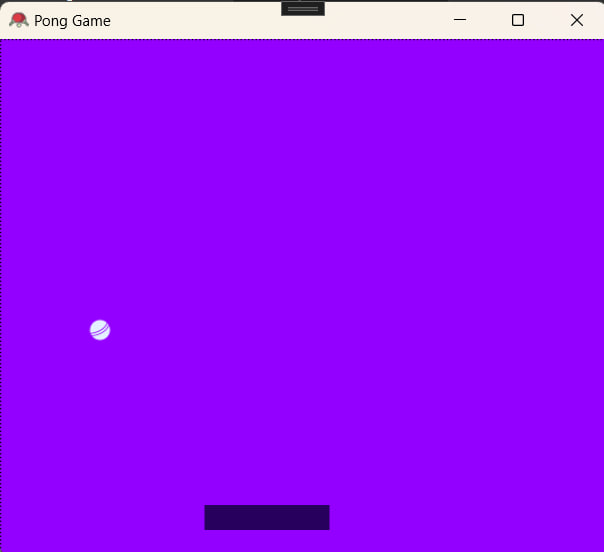
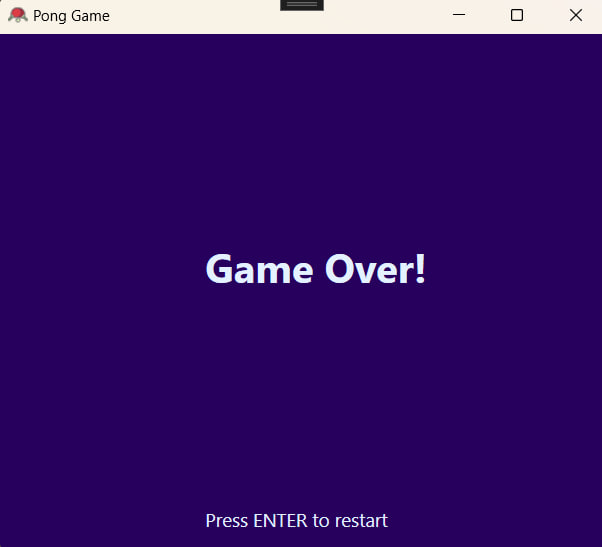

# README.md

This is the pong game using WPF where XAML is a frontend language and C# is a backend languages.

- Ball icon from [Cricket ball icons created by Vector Stall - Flaticon](https://www.flaticon.com/free-icons/cricket-ball)

- Game icon from [Table-tennis icons created by Icongeek26 - Flaticon](https://www.flaticon.com/free-icons/table-tennis)

- Color pallete from [here](https://colorhunt.co/palette/27005d9400ffaed2ffe4f1ff)
## Screenshots

## Authors

- [@Yasya12](https://github.com/Yasya12)

